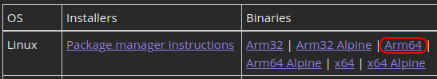

# .NET SDK - Raspberry Pi

Download and install the .NET 7 SDK for 64-bit ARM devices, located [here](https://dotnet.microsoft.com/en-us/download/dotnet/7.0).

> _Why are we using the 64-bit SDK?_
>
> .NET gRPC services are not supported in the 32-bit SDK.
